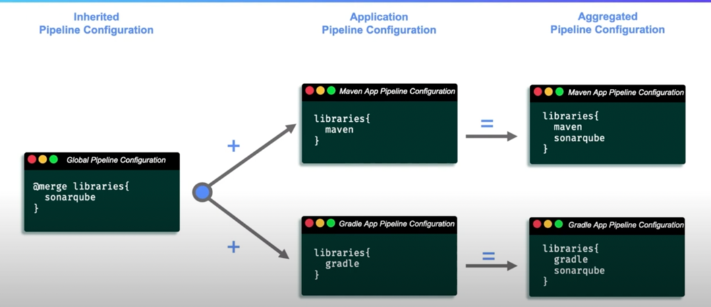

1. sonarqube/static_code_analysis.groovy 
```groovy
void call(){
    Stage('SonarQube: Static Code Analysis'){
        //parse configuration
        String sannerVersion = config.scanner_version ?: "SonarScanner 4.0"
        String serverName = config.server_name ?: "My SonarQube Server"
        Boolean enforceQualityGate =  config.containsKey("enforce_quality_gate") ? config.enforce_quality_gate : true 
        
        node {
            def scannerHome = tool(scannerVersion)
            withSonarQubeEnv(serverName){
                sh "${scannerHome}/bin/sonar-scanner"
            }
        }
        
        timeout(time: 1, unit: "HOURS"){
            def qg = waitForQualityGate()
            if (qg.status != 'OK'){
                if (enforceQualityGate){
                    error "Pipeline aborted due to quality gate failure: ${qg.status}"
                } else {
                    warning "Quality gate failure: ${qg.status}"
                }
            }
        }
    }
}
```
2. In the library section we need to specify the following thing 
```groovy
libraries {
    maven 
    sonarqube {
        scanner_version = "SonarScanner 3.0"
        enforce_quality_gate = false 
    }
}
```
3. Hierarchial pipeline Configuration


5. 